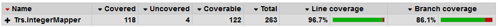

# Overview

** NB: THIS IS PRE-RELEASE SOFTWARE **

_Integer Mapper_ maps data structures to monotonically increasing consecutive integers starting from 0, with 0 being reserved for `null` or any collection that is empty. This applies to strings as well, with the empty string being mapped to 0.

Integer Mapper is useful for implementing hashing and equality in the sense that everything is always mapped to a predictable value. The value can serve as a hash code, but that can also directly be used to compare two objects.

It is also possible to get the original data back because the mapped integers preserve equality. This makes it useful for things like caching, or algorithms that need to represent complex data as a simple integer that is mapped to an array address.

# Usage

The core interface for mapping values is `IIntegerMapper`. All mappers implement this interface.

For example, to map `string` and then get the original string back from the assigned `uint`:

```C#
IIntegerMapper<string> mapper = new StringMapper();

mapper.Map("One");
mapper.Map("Two");
mapper.Map("Three");

for (uint i = 0; i < mapper.MappedObjectsCount; i++)
{
    string originalValue = mapper.ReverseMap(i);
    Console.WriteLine($"{i} => {originalValue}");
}

// Output:
// 0 =>
// 1 => One
// 2 => Two
// 3 => Three
```

Note that all collections contain the empty case, which is mapped to 0. For example, `StringMapper` maps 0 to the empty string. This also means that all collections contain at least one element.

Integer Mapper also supports `byte[]` and `IEnumberable<byte>`, ex.:

```C#
IIntegerMapper<byte[]> mapper1 = new ByteArrayMapper();
IIntegerMapper<IEnumerable<byte>> mapper2 = new ByteEnumerableMapper();
```

# Installation via Nuget

See [https://www.nuget.org/packages/Trs.IntegerMapper/](https://www.nuget.org/packages/Trs.IntegerMapper/) for nuget package.

# Unit Test Code Coverage

Unit tests can be run using the `.\test.ps1` script. This will generate a code coverage report in the `.\UnitTestCoverageReport` folder using [Coverlet](https://github.com/tonerdo/coverlethttps://github.com/tonerdo/coverlet) and [ReportGenerator](https://github.com/danielpalme/ReportGenerator).



# Licence

Integer Mapper is released under the MIT open source licence. See LICENCE.txt in this repository for the full text.
